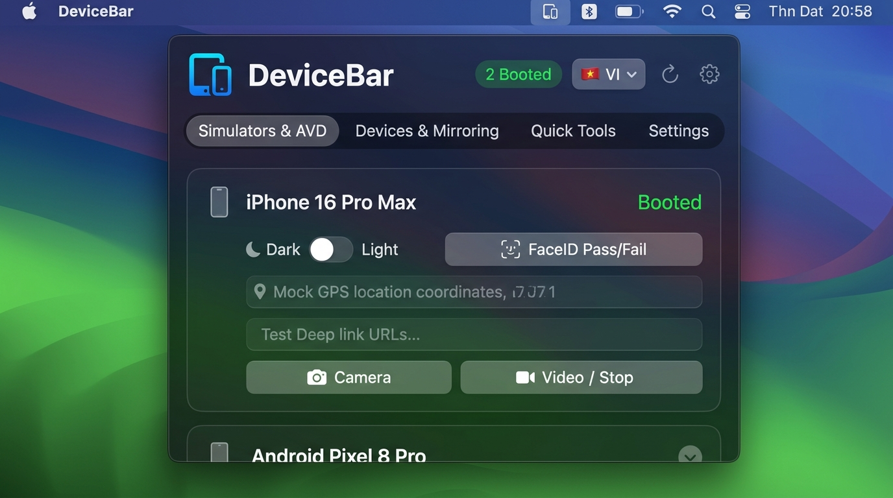
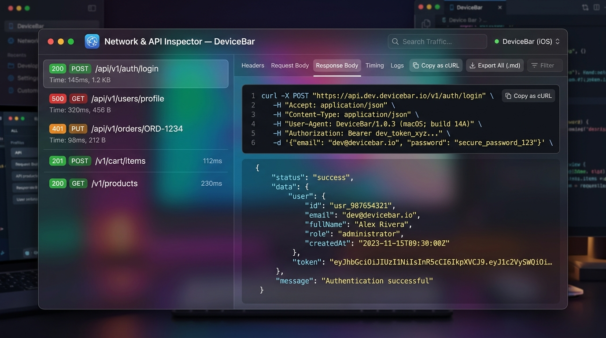

# 🚀 DeviceBar

<p align="center">
  
  
  
  
</p>

> **DeviceBar** is a native macOS Menu Bar application tailored for mobile developers (iOS, Android, Flutter, React Native). It unifies iOS Simulator management, Android AVD controls, real device screen mirroring (`scrcpy`), real-time Network/API inspection with cURL generation, instant crash analysis, multi-language support (English & Vietnamese), and one-click developer cache cleaning (DerivedData, Gradle, SPM).

<p align="center">
  
</p>

---

## ✨ Key Features

### 1. 🍎 Advanced iOS Simulator Management
* **Real-time State Tracking:** Instantly monitors `Booted` and `Shutdown` simulators with automatic top-sorting for active devices.
* **1-Click Quick Controls:**
  * Toggle system **Dark Mode / Light Mode** (`xcrun simctl ui appearance`).
  * Simulate **FaceID** authentication (`Match` or `Fail`).
  * **Mock GPS Location:** Teleport instantly to Hanoi, HCMC, Cupertino, Tokyo, Singapore, San Francisco, London...
  * **Deep Link Opener:** Dispatch URL schemes (`myapp://path/order?id=123`) directly into the running app.
  * **Precision Screenshots:** Capture with transparent alpha mask (`.alpha`) or rectangular frame (`.ignored`), copied to Clipboard or saved to Desktop.
  * **Video Recording:** Record 10s MP4 screen captures saved directly to Desktop.
  * **Two-way Clipboard Sync:** Seamlessly paste clipboard text between Mac and Simulator.
  * **Safe Wipe Confirmation:** Protected reset dialog before erasing simulator data.
* **🛠 Developer Power Tools:**
  * 🗂 **Open App Sandbox in Finder:** Jump straight into your app's `Documents / Library / Cache` directory to inspect SQLite databases, Realm files, and local caches.
  * 📁 **Open Root Data Directory:** View the raw device container in Finder.
  * 🖼 **Push Custom Media:** Pick any image or video from your Mac and insert it into the Simulator Photos library.
  * 📦 **Install `.app` Bundles:** Pick and deploy `.app` builds with one click.
  * 🔔 **Simulate Push Notifications:** Dispatch test `.apns` payloads directly onto the Simulator screen.
  * 👋 **Shake Gesture:** Trigger in-app developer menus (React Native, Expo, Flutter).
  * 🔒 **Reset Privacy Permissions:** Clear Camera, Photos, Location, and Push permissions in one tap.

---

### 2. 🤖 Android AVD & Emulator Control
* **Accurate AVD Detection:** Reliably resolves emulator port mapping (`emulator-xxxx`) to the real AVD configuration name.
* **Power Lifecycle:**
  * Standard Boot, **Cold Boot** (`-no-snapshot-load`), and **Protected Wipe Data** (`-wipe-data`).
* **Android Quick Tweaks:**
  * Toggle **Dark Theme** (`cmd uimode night yes/no`).
  * **Show Touches:** Visual pointer feedback for screen recordings and client demos.
  * Direct shortcut to Android **Developer Settings**.
  * Mock GPS Coordinates and Deep Link Dispatcher (`am start -a ...`).
  * Chained screenshot capture and video recording.
* **🛠 Android Power Tools:**
  * 📦 **Install APK:** Install any local `.apk` file via `adb install -r`.
  * 🖼 **Send Media to Gallery:** Push photos/videos to `/sdcard/Pictures/` and automatically trigger media scanner broadcasts.
  * 🧹 **Clear App Data & Cache:** Purge application state in seconds (`adb shell pm clear`).
  * 🕹 **Virtual Keys & Dev Menu:** Home, Back, and Dev Menu keycodes (`keyevent 82`).

---

### 3. 🌐 Network & API Inspector (cURL & Markdown Export)

<p align="center">
  
</p>

* **Real-time Master-Detail Inspector:** Observe live API traffic from both iOS Simulators and Android Emulators without modifying client code.
* **Automatic Protocol Parsing:** Compatible with **OkHttp, Retrofit, Dio (Flutter), URLSession, Axios**.
* **Smart Filter:** 
  * Instant toggle for 🔴 **Errors Only (4xx, 5xx, Failed)**.
  * Real-time search filter by endpoint, URL, or method.
* **Instant cURL Generation:**
  * **`[ Copy as cURL ]`** button generates full, reproducible `curl -X ...` commands with headers and body for Postman or Terminal testing.
* **Interactive Inspection:**
  * Pretty-printed JSON formatted Request / Response bodies with syntax coloring.
  * Detailed request/response headers and latency metrics.
* **📊 Markdown (.md) Export:**
  * Export the entire API call history into clean GitHub-flavored Markdown reports with summary tables, cURL blocks, and payloads.
  * One-click copy Markdown directly to Clipboard for Jira, Slack, or GitHub issues.

---

### 4. 🐞 Crash Detective (Instant Crash Catcher)
* **One-Click Error Catching:** Caught by surprise when an app suddenly crashes? Click **Crash Detective** in the Tools menu.
* **Accurate Extraction:**
  * **Android:** Parses `AndroidRuntime: FATAL EXCEPTION` to pinpoint NullPointerException, OutOfMemory, or unhandled runtime errors.
  * **iOS:** Reads the latest crash logs from `~/Library/Logs/DiagnosticReports/`.
* **Actionable Output:** Displays Exception Type, file, crashing line, and full Stack Trace with a 1-click **Copy Stack Trace** button.

---

### 5. 📱 Physical Devices & Screen Mirroring
* Automatically detects real hardware devices connected via USB or Wi-Fi.
* Displays manufacturer brand and exact hardware model names.
* **Ultra-low latency Screen Mirroring:** One-click launch via `scrcpy`.
* **Wireless ADB:** Switch to wireless debugging over Wi-Fi (port 5555) with a single tap.

---

### 6. 🧹 Smart Developer Storage Cleaner
* **Real-time Cache Analyzer:**
  * Xcode DerivedData (`~/Library/Developer/Xcode/DerivedData`)
  * Android Gradle Caches (`~/.gradle/caches`)
  * Swift Package Manager & CocoaPods Cache
  * iOS DeviceSupport Symbols
  * Simulator Logs & Caches
  * Xcode Archives
* **1-Click Clean All Safe:** Reclaims tens of gigabytes of disk space safely with one button press.

---

### 7. 🌍 Multi-Language & Preferences (v1.2.0)
* **Instant Hot-Switch Language:** Switch between **English 🇺🇸** and **Tiếng Việt 🇻🇳** with a single click right on the Header Bar (`[🇻🇳 VI] / [🇺🇸 EN]`) without restarting the app.
* **Comprehensive Settings:**
  * Toggle **Launch at Login** via macOS `SMAppService`.
  * Configurable **Background Refresh Rate** (1.5s Fast, 3s Standard, 6s Low Battery, or Manual).
  * **Developer Environment Diagnostics:** Real-time status checks for Xcode CLT (`xcrun simctl`), Android SDK/ADB, and `scrcpy`.
  * **Network Inspector Buffer:** Configurable buffer capacity (50, 100, 200, 500 items) and clear history.

---

### 8. ⌨️ macOS Native Experience & Shortcuts
* Built with 100% native SwiftUI and AppKit.
* Runs purely in the Menu Bar (`LSUIElement = true`) with zero Dock clutter.
* Dynamic menu bar badge displaying active booted device count.
* **Global Keyboard Shortcuts:**
  * <kbd>⌘1</kbd>: Simulators & AVD Tab
  * <kbd>⌘2</kbd>: Physical Devices & Mirroring Tab
  * <kbd>⌘3</kbd>: Quick Tools & Storage Cleaner Tab
  * <kbd>⌘4</kbd>: Settings & Preferences Tab
  * <kbd>⌘F</kbd>: Quick Search Filter
  * <kbd>⌘R</kbd>: Refresh System State

---

## 🛠 Installation & Building

### Requirements
* macOS 13.0 (Ventura) or later.
* Xcode Command Line Tools (`xcode-select --install`).
* *(Optional for Android mirroring):* `brew install scrcpy`
* *(Optional for physical iPhone capture):* `brew install libimobiledevice`

### Build from Source
```bash
# Clone the repository
git clone git@github.com:NtbAndroidDev/device-bar.git
cd device-bar

# Compile Release build and package macOS App Bundle
./build_app.sh

# Install into /Applications
cp -R "DeviceBar.app" /Applications/

# Launch application
open /Applications/DeviceBar.app
```

### Package into `.dmg` Installer
```bash
# Generates a standalone DeviceBar-v1.2.0.dmg installer
./create_dmg.sh
```

---

## 📄 License
This project is licensed under the [MIT License](LICENSE).
